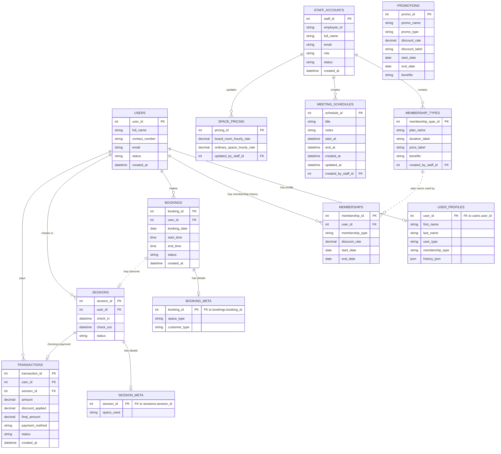

    # AIMS Entity Relationship Diagram

This ERD is inferred from the Supabase calls in `lib/services/aims_api_client.dart`.
No SQL migration/schema dump is present in the repository, so fields shown here are the columns the app currently reads or writes.

## Written Form

### Entities and Attributes

#### 1. USERS

Stores the customer or coworking-space user account.

- `user_id` - Primary key
- `full_name` - User/customer full name
- `contact_number` - Contact number
- `email` - Email address
- `status` - Current user status, such as `Active` or `Inactive`
- `created_at` - Date and time the user record was created

#### 2. USER_PROFILES

Stores extended user details that are separated from the main `users` table.

- `user_id` - Primary key and foreign key referencing `users.user_id`
- `first_name` - User first name
- `last_name` - User last name
- `user_type` - User category, such as `Student` or `Professional`
- `membership_type` - Current membership label, such as `Open Time`, `Annual`, `Monthly Membership`, or `Loyalty Rewards`
- `history_json` - JSON list of user activity history entries

#### 3. MEMBERSHIPS

Stores membership records assigned to users.

- `membership_id` - Primary key
- `user_id` - Foreign key referencing `users.user_id`
- `membership_type` - Membership plan name or label
- `discount_rate` - Discount rate for the membership, if any
- `start_date` - Membership start date
- `end_date` - Membership end date

#### 4. BOOKINGS

Stores reservation records made by users.

- `booking_id` - Primary key
- `user_id` - Foreign key referencing `users.user_id`
- `booking_date` - Date of the booking
- `start_time` - Booking start time
- `end_time` - Booking end time
- `status` - Booking status, such as `Pending`, `Confirmed`, or `Cancelled`
- `created_at` - Date and time the booking was created

#### 5. BOOKING_META

Stores additional details for a booking.

- `booking_id` - Primary key and foreign key referencing `bookings.booking_id`
- `space_type` - Reserved space type, such as `Board Room` or `Open Space`
- `customer_type` - Customer category for the booking, such as `Guest`

#### 6. SESSIONS

Stores check-in and check-out records.

- `session_id` - Primary key
- `user_id` - Foreign key referencing `users.user_id`
- `check_in` - Check-in date and time
- `check_out` - Check-out date and time
- `status` - Session status, such as `Active` or `Completed`

#### 7. SESSION_META

Stores additional details for a user session.

- `session_id` - Primary key and foreign key referencing `sessions.session_id`
- `space_used` - Space used during the session, such as `Board Room` or `Open Space`

#### 8. TRANSACTIONS

Stores payment records created during checkout.

- `transaction_id` - Primary key
- `user_id` - Foreign key referencing `users.user_id`
- `session_id` - Foreign key referencing `sessions.session_id`
- `amount` - Original amount before discount
- `discount_applied` - Discount amount applied
- `final_amount` - Final amount paid
- `payment_method` - Payment method, such as `cash`
- `status` - Payment status, such as `paid`
- `created_at` - Date and time the transaction was created

#### 9. STAFF_ACCOUNTS

Stores staff, manager, and admin accounts used for system login.

- `staff_id` - Primary key
- `employee_id` - Staff employee identifier
- `full_name` - Staff full name
- `email` - Staff email address
- `role` - Account role, such as `Admin`, `Manager`, or `Staff`
- `status` - Account status, such as `Active` or `Inactive`
- `created_at` - Date and time the staff account was created

#### 10. MEMBERSHIP_TYPES

Stores membership plans that can be managed by staff or managers.

- `membership_type_id` - Primary key
- `plan_name` - Membership plan name
- `duration_label` - Duration display text
- `price_label` - Price display text
- `benefits` - Membership benefits
- `created_by_staff_id` - Foreign key referencing `staff_accounts.staff_id`

#### 11. PROMOTIONS

Stores promotion records.

- `promo_id` - Primary key
- `promo_name` - Promotion name
- `promo_type` - Promotion type/category
- `discount_rate` - Numeric discount rate
- `discount_label` - Discount display text
- `start_date` - Promotion start date
- `end_date` - Promotion end date or expiry date
- `benefits` - Promotion benefits or notes

#### 12. SPACE_PRICING

Stores hourly pricing for coworking-space usage.

- `pricing_id` - Primary key
- `board_room_hourly_rate` - Hourly rate for the board room
- `ordinary_space_hourly_rate` - Hourly rate for open space
- `updated_by_staff_id` - Foreign key referencing `staff_accounts.staff_id`

#### 13. MEETING_SCHEDULES

Stores meeting or calendar schedules created by staff.

- `schedule_id` - Primary key
- `title` - Schedule title
- `notes` - Schedule notes
- `start_at` - Schedule start date and time
- `end_at` - Schedule end date and time
- `created_at` - Date and time the schedule was created
- `updated_at` - Date and time the schedule was last updated
- `created_by_staff_id` - Foreign key referencing `staff_accounts.staff_id`

### Relationships

| Relationship | Cardinality | Description |
| --- | --- | --- |
| `users` to `user_profiles` | One-to-zero-or-one | One user may have one profile record. |
| `users` to `memberships` | One-to-many | One user may have multiple membership records over time. |
| `users` to `bookings` | One-to-many | One user may create many bookings. |
| `bookings` to `booking_meta` | One-to-zero-or-one | One booking may have one metadata record containing space and customer type details. |
| `users` to `sessions` | One-to-many | One user may check in many times, creating many session records. |
| `sessions` to `session_meta` | One-to-zero-or-one | One session may have one metadata record containing the space used. |
| `sessions` to `transactions` | One-to-many | One session may have one or more payment transaction records. |
| `users` to `transactions` | One-to-many | One user may have many payment transactions. |
| `membership_types` to `memberships` | Logical one-to-many | Membership records store the membership plan as text, so this is a logical relationship through plan name rather than a visible ID foreign key in the app code. |
| `staff_accounts` to `membership_types` | One-to-many | One staff account may create many membership types. |
| `staff_accounts` to `space_pricing` | One-to-many | One staff account may update pricing records. |
| `staff_accounts` to `meeting_schedules` | One-to-many | One staff account may create many meeting schedules. |
| `bookings` to `sessions` | Workflow relationship | When a booking is checked in, the system creates or reuses an active session for the same user. The code does not store `booking_id` on the session record. |
| `promotions` to `transactions` | No direct stored relationship | Promotions are managed separately. Transactions store only the discount amount through `discount_applied`, not a `promo_id`. |

## Relationship Notes

- `users` is the main customer table. It connects to bookings, sessions, transactions, profiles, and memberships through `user_id`.
- `user_profiles`, `booking_meta`, and `session_meta` behave like one-to-one extension tables for `users`, `bookings`, and `sessions`.
- The dotted `bookings` to `sessions` line is a workflow association: checking in a booking creates or reuses a user session, but the code does not store `booking_id` on `sessions`.
- `memberships.membership_type` stores the plan name as text. The app also has `membership_types.plan_name`, but no `membership_type_id` reference is used in code.
- `transactions` are created at checkout from the active `session_id` and `user_id`.
- `promotions` are managed independently. The current transaction table stores only `discount_applied`, not a `promo_id`.
- `staff_accounts` are used for admin, manager, and staff login. Staff IDs are also recorded on membership type creation, meeting schedule creation, and space pricing updates.
- Loyalty rewards are derived from session counts in the app, not stored as a separate table in the current code.
